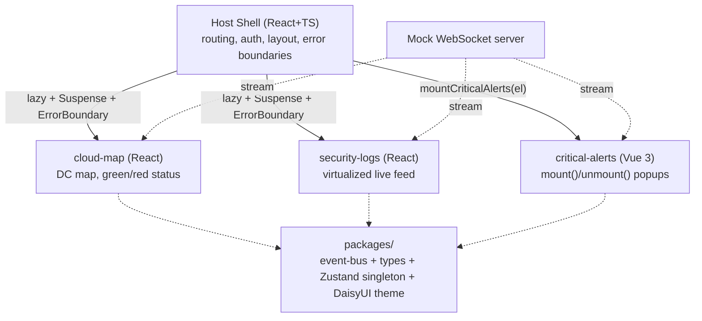

# NOC/SOC MFE - Proof-of-Ability Plan

## Goal

Build a small real-time NOC/SOC dashboard as a Micro Frontend to prove MFE ability for the interview. Optimize for a clean, demoable slice that shows the abilities in the diagram - not production completeness.

## Architecture

- **Host Shell (React):** routing, auth, layout, error boundaries, loads remotes.
- **cloud-map (React):** global DC map; green = normal, red = DDoS/high load. Clicking a DC sets `selectedDcId`.
- **security-logs (React):** virtualized live feed; filters by `selectedDcId`.
- **critical-alerts (Vue 3):** framework-agnostic popups (disconnects, latency spikes).

## Tech

- Vite 6 + `@module-federation/vite` (MF 2.0); pnpm workspaces; TypeScript strict.
- WebSockets for live streams; small Node WS **mock server with a data generator** (IPs, countries, DC coords, block/allow, statuses) - provided as part of the build.
- Routing: **TanStack Router** (shell).
- Virtualization: `**@tanstack/react-virtual**` (security-logs feed).
- Map: **SVG world map with status dots first** (zero deps/network); optional upgrade to `**react-leaflet`** with colored DC markers if time allows (note: Leaflet marker-icon path needs a small Vite fix).
- `react`/`react-dom`/`zustand` shared as `singleton: true`.
- **Styling: Tailwind v4 + DaisyUI** as the design system (no hand-built components). Build-time CSS, so it stays **out** of the MF `shared` config.
- Every remote wrapped in `ErrorBoundary` + `Suspense` (fault isolation).
- Dev orchestration: root script runs shell + remotes concurrently on fixed ports.

## Styling / design tokens (minimalist)

- DaisyUI replaces a custom `ui-tokens` package - its theme system is the token layer.
- **One shared theme file** `packages/theme/theme.css` defines a `noc` DaisyUI theme with just the semantic colors used: `--color-success` (DC healthy = green), `--color-error` (DC under attack = red), `--color-base-100` (dark dashboard bg).
- Every app imports that file and inherits `data-theme="noc"` set on the shell root. Change a color once, all three remotes (incl. Vue) follow.
- Use semantic classes directly: `badge-success`/`badge-error` for DC status, `alert-error` for critical popups, `table` for the log feed.
- Each app owns its Tailwind config (per-app, some CSS duplication - fine for a demo). Upgrade path: shared `packages/tailwind-config` preset.

## State strategy (the seniority signal)

- **Thin Zustand singleton** for shared read-state (`selectedDcId`, auth, connectionStatus) - a late-mounting remote reads current state instead of missing an event. Vue reads the same vanilla store.
- **Typed event bus** for transient fire-and-forget signals.
- Local UI state (log pause, map zoom) stays in component state - not the store.

## Schedule (2 weeks, lean)

- **Days 1-2:** Scaffold monorepo + federation skeleton (shell + 1 remote, `build && preview`). Add `packages/` (event-bus, types, Zustand store, DaisyUI `theme.css`), wire Tailwind v4 + DaisyUI per app, and the mock WS server.
- **Days 3-4:** `cloud-map` remote (SVG status map + set `selectedDcId`).
- **Days 5-6:** `security-logs` remote (`@tanstack/react-virtual` feed + filter by `selectedDcId`); WS reconnect.
- **Days 7-8:** `critical-alerts` Vue remote with `mount()/unmount()`, reading the shared store.
- **Days 9-10:** README + diagram; rehearse the 3-min walkthrough and system-design talking points.
- **Throughout:** 45 min/day JS/React/TS fundamentals (closures, event loop, Promises, TS generics, hooks) as live-coding insurance.

## Be ready to talk about

- When MFE is worth it vs a modular monorepo (know the cost).
- Shared-dep singletons + manifest version negotiation.
- Events vs shared store (late-subscriber problem); why not one global Redux store.
- Fault isolation via error boundaries; real-time tradeoffs (WS vs SSE vs polling, virtualization).
- Consistent design across frameworks via one shared DaisyUI theme (build-time CSS, no runtime singleton); per-app config tradeoff + shared-preset upgrade path.

## Scope guardrails (skip for now)

- No production concerns: no CI/CD, LRU/circuit-breakers, exhaustive tests, or perf tuning.
- One happy-path E2E at most; keep each remote to a single focused screen.
- Vue remote hard-capped to one widget - if it slips, ship it documented, don't block the React work.
- Separate new Vite repo (not this Payload/Next.js repo).

